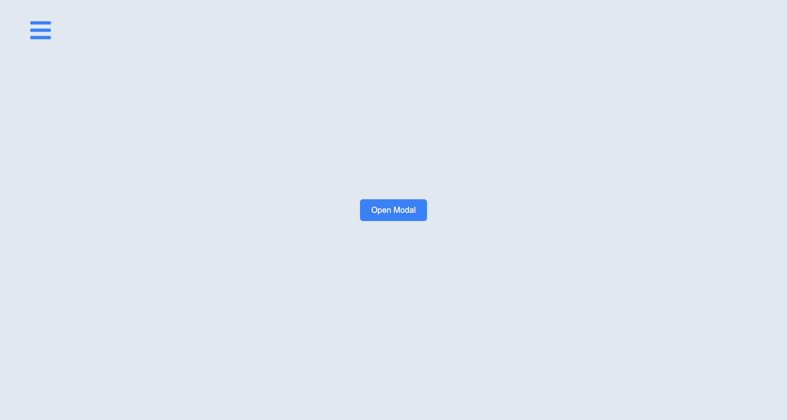
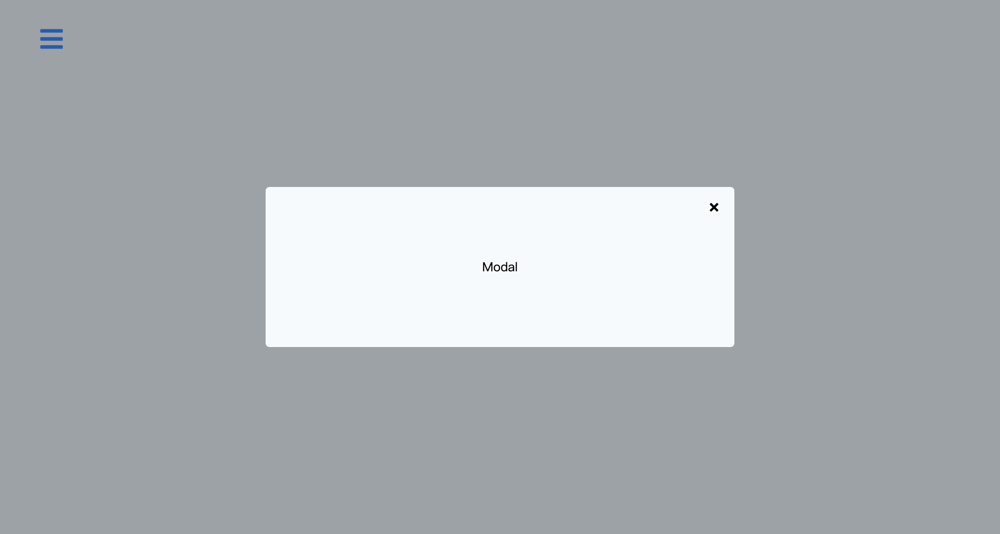
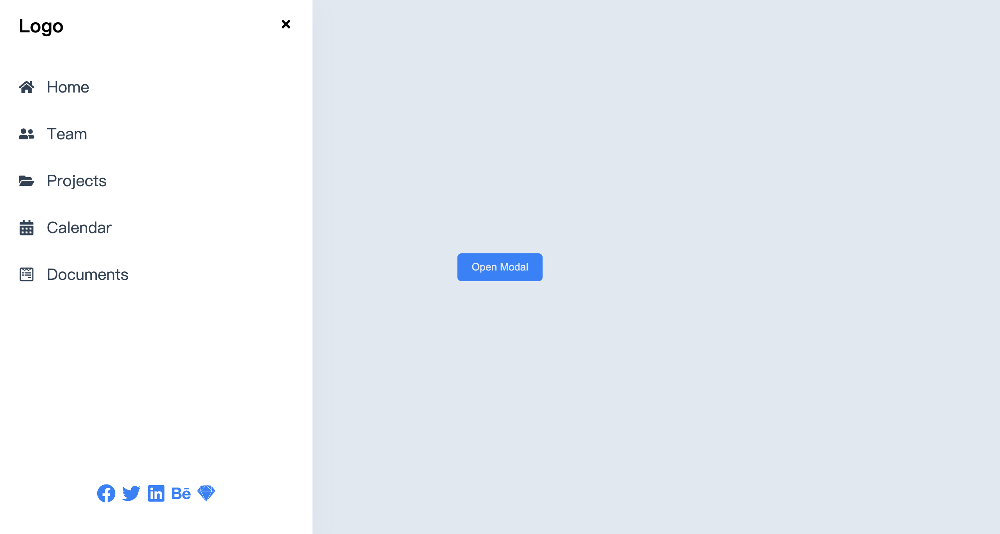

## Sidebar & Modal

## Steps

1. **Data** - 添加 `data.jsx` ，包含链接的文本、URL和图标
2. **Create Components** - 创建3个组件并在 `App.jsx` 中 render: Home, Modal, 和 Sidebar
3. **Global Context** - 设置 Global Context API 和 Custom Hook。
4. **Global State Values** - 设置2个布尔值的状态变量： `isSidebarOpen` 和 `isModalOpen`。设置4个函数用于打开和关闭 Modal 和 Sidebar。
5. **Home Component** - In Home, set up two buttons and get two functions from global context, openSidebar and openModal. Once the user clicks the button, invoke one of the functions. Set up CSS for the buttons.
6. **Modal and Sidebar Component** - Create a Modal component and add modal CSS. Repeat the same steps with the Sidebar component.
